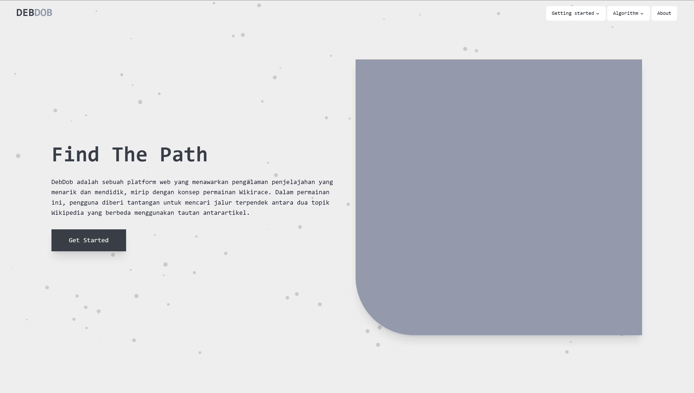
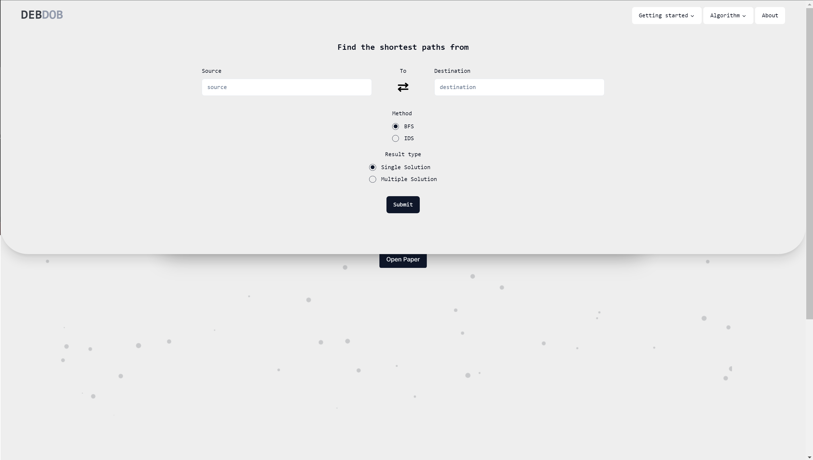
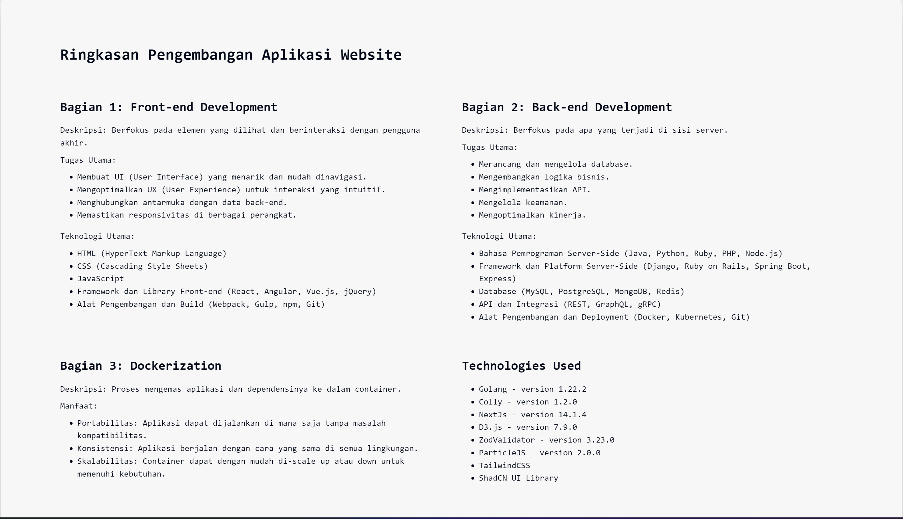
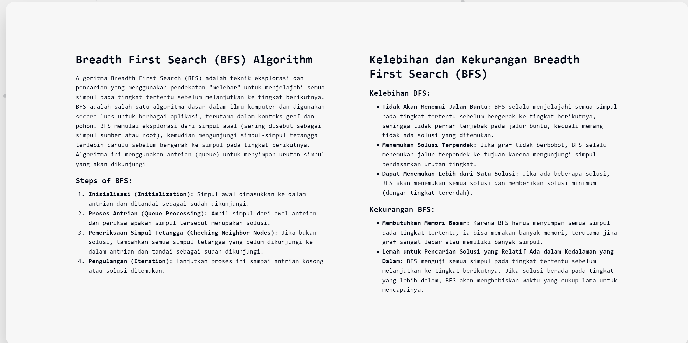
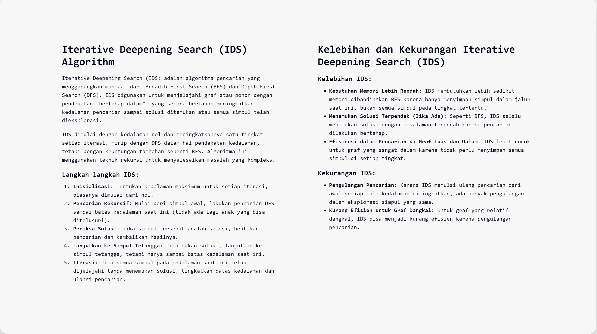
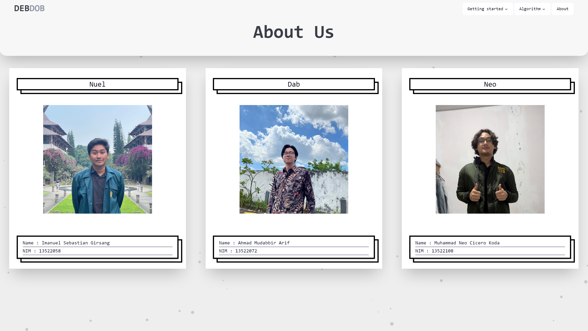
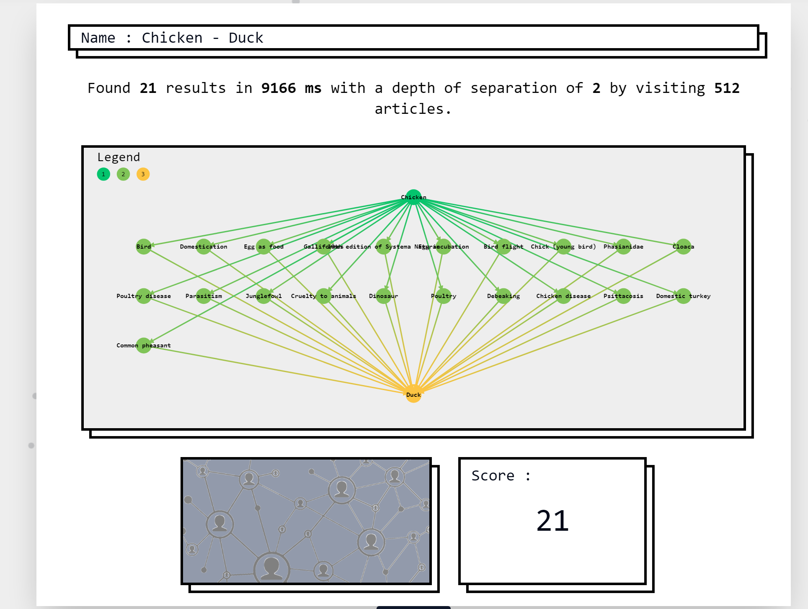

## DebDob Wikirace's Website API

- This website API is created by Team DebDob, consisting of Nuel, Neo, and Dabbir, as part of our second major assignment for the Algorithm Strategies course. The website implements the Breadth-First Search (BFS) and Iterative Deepening Search (IDS) algorithms to find the shortest path from one Wikipedia article to another. We hope you enjoy exploring it!

## Table of Contents

- [Breadth First Search (BFS)](#breadth-first-search-bfs)
- [Iterative Deepening Search (IDS)](#iterative-deepening-search-ids)
- [Technologies Used](#technologies-used)
- [Program Requirement](#program-requirement)
- [Steps to Run](#steps-to-run)
- [Preview](#preview)
- [Author](#author)

## Breadth First Search (BFS)
Breadth-First Search (BFS) explores graphs and trees level-by-level, visiting all nodes at a given depth before moving deeper. It uses a queue for tracking nodes to visit, making it ideal for finding the shortest path in unweighted graphs. BFS has a time complexity of O(V + E), where V is the number of vertices and E is the number of edges, and it's often used for level-order traversal or identifying connected components. This approach ensures every node is explored in the shortest possible time, making it a key tool in various applications.
## Iterative Deepening Search (IDS)
Iterative Deepening Search (IDS) is a hybrid approach combining depth-first and breadth-first strategies. IDS performs depth-limited depth-first searches, increasing the depth limit incrementally with each iteration. This method is especially useful when the depth of the graph is unknown, providing a way to explore without high memory usage. With a time complexity akin to BFS and lower space complexity, IDS is commonly applied in puzzle-solving, game trees, and other contexts where depth is uncertain. This iterative process allows for more efficient exploration in large or deep structures, making it versatile for different search-related problems

## Technologies Used

- Golang - version 1.22.2
- NextJs - version 14.1.4
- D3.js - version 7.9.0
- ZodValidator - version 3.23.0
- ParticleJS - version 2.0.0
- TailwindCSS
- ShadCN UI Library

## Program Requirement

- NodeJs 20^
- Golang 1.22.2
- Docker Desktop

# Steps to Run (With Docker)

## Step 1: Ensure Docker Desktop is running
- Docker Desktop should be installed on your machine. 
- Ensure Docker Desktop is running before proceeding.

## Step 2: Clone the Frontend Repository
```bash
git clone https://github.com/ImanuelSG/Tubes2_FE_debdob
```
## Step 3: Move to the Frontend Directory
``` bash
cd Tubes2_FE_debdob
```
## Step 4: Start Docker Compose for Frontend
```bash
docker compose -f "docker-compose.prod.yml" up -d --build
```
## Step 5: Clone the Backend Repository
```bash
git clone https://github.com/neokoda/Tubes2_BE_DebDob
```
## Step 6: Download our cache.json from Google Drive and Add inside src folder
Link to download the cache : https://drive.google.com/drive/folders/1hukgyjk7nF8JFvvB1JmTk5fXTr0h0Fww?usp=sharing
## Step 7: Move to the Backend Directory
```bash
cd Tubes2_BE_DebDob  # Navigate to the backend from frontend
```
## Step 8: Start Docker Compose for Backend
```bash
docker compose up
```
## Step 9: Navigate to localhost:3000
Open localhost:3000 in your browser
# Steps to Run (Without Docker)

## Step 1: Clone the Frontend Repository
```bash
git clone https://github.com/ImanuelSG/Tubes2_FE_debdob
```
## Step 2: Move to the Frontend Directory
``` bash
cd Tubes2_FE_debdob
cd src
```
## Step 3: Install all packages
```bash
npm install
```
## Step 4: Start the node app
```bash
npm run dev
```
## Step 5: Clone the Backend Repository
```bash
git clone https://github.com/neokoda/Tubes2_BE_DebDob

```
## Step 6: Download our cache.json from Google Drive and Add inside src folder
Link to download the cache : https://drive.google.com/drive/folders/1hukgyjk7nF8JFvvB1JmTk5fXTr0
## Step 7: Move to the Backend Directory
```bash
cd Tubes2_BE_DebDob  # Navigate to the backend from frontend
cd src
```
## Step 8: Start the Golang App
```bash
go mod download
go run .
```
## Step 9: Navigate to localhost:3000
Navigate to localhost:3000 to open the website

## Preview
### Homepage

### Form Page

### Tech Stack Used

### BFS Explanation Page

### IDS Explanation Page

### About Us Page

### Example of Result

## Author
Created by:

| Name                      | NIM      | Contact                     |Github
| ------------------------- | -------- | --------------------------- |------
| Imanuel Sebastian Girsang | 13522058 | 13522058@std.stei.itb.ac.id |[ImanuelSG](https://github.com/ImanuelSG)
| Ahmad Mudabbir Arif       | 13522072 | 13522072@std.stei.itb.ac.id |[Dabbir](https://github.com/Dabbir)
| Muhammad Neo Cicero Koda  | 13522108 | 13522108@std.stei.itb.ac.id |[neokoda](https://github.com/neokoda)